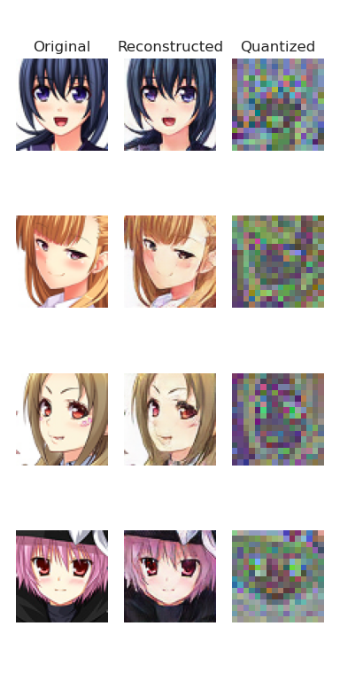
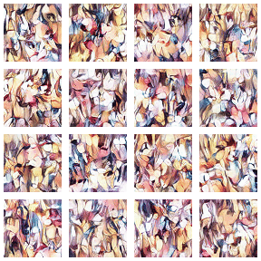

## Images Generation with Latent Diffusion models

This repository contains the code for generating images with the Latent Diffusion models, as described in the paper [Latent Diffusions for Generative Modeling](https://arxiv.org/abs/2006.11239),tested on [Anime Faces dataset](https://www.kaggle.com/datasets/soumikrakshit/anime-faces).

## VQVAE Training results

- VQVAE Output during training (every 500 iterations)


- Original Vs Reconstructed images




## Latent diffusion model results

- Latent diffusion output during training (every 2000 iterations)



- Latent diffusion generation process (decoded every 20 timesteps)


## Setup

```
git clone git@github.com:abdelnour13/images_generation_latent_diffusion_models.git
conda create -n latent-diffusion
conda activate latent-diffusion
pip install requirements.txt
```

## Download data

```
python3 download.py [-h] --datasets {celeb_a,anime_faces,celeb_a anime_faces}
```

## Create an experiment

```
python3 create.py [-h] [--on-exists {error,overwrite}] --name NAME --type {vqvae,diffusion,gan}
```

## Models training

- To train the VQVAE

```
cd src/training
python3 vqvae.py --experiment EXPERIMENT
```

- To train the Latent diffusion model

```
cd src/training
python3 diffusion.py --experiment EXPERIMENT
```