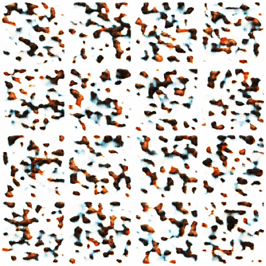

## Images Generation with Latent Diffusion models

This repository contains the code for generating images with the Latent Diffusion models, as described in the paper [Latent Diffusions for Generative Modeling](https://arxiv.org/abs/2006.11239),tested on the following datasets : [Anime Faces dataset](https://www.kaggle.com/datasets/soumikrakshit/anime-faces), [Google cartoon faces](https://www.kaggle.com/datasets/brendanartley/cartoon-faces-googles-cartoon-set) and [Bitmoji faces
](https://www.kaggle.com/datasets/romaingraux/bitmojis).

For all the datasets the models were trained to generate images unconditionally,additionally for [Anime Faces dataset](https://www.kaggle.com/datasets/soumikrakshit/anime-faces) the model was trained to generate an image from a binary mask as well ([Results](https://github.com/abdelnour13/images_generation_latent_diffusion_models/blob/main/notebooks/anime_faces/diffusion_cond.ipynb)),and for the [Google cartoon faces dataset](https://www.kaggle.com/datasets/brendanartley/cartoon-faces-googles-cartoon-set) a model to generate images from categorical attributes was also trained ([Results](https://github.com/abdelnour13/images_generation_latent_diffusion_models/blob/main/notebooks/cartoon_faces/diffusion_cond.ipynb)) while for the [Bitmoji faces dataset](https://www.kaggle.com/datasets/romaingraux/bitmojis) i experimented with generating images from a color palette ([Results](https://github.com/abdelnour13/images_generation_latent_diffusion_models/blob/main/notebooks/bitmoji/diffusion_cond.ipynb)).

Checkpoints are available on kaggle [here](https://www.kaggle.com/models/fellahabdelnour13/diffusion_models).

## VQVAE Training results (Google's cartoon dataset)

- VQVAE Output during training


- Original Vs Reconstructed images


## Latent diffusion model results (Google's cartoon dataset)

- Latent diffusion output during training (every 2000 iterations)



- Latent diffusion generation process (decoded every 20 timesteps)


## Setup

```
git clone git@github.com:abdelnour13/images_generation_latent_diffusion_models.git
conda create -n latent-diffusion
conda activate latent-diffusion
pip install requirements.txt
```

## Download data

```
python3 download.py [-h] --datasets {celeb_a,anime_faces,cartoon_faces,anime_faces_2,art_pictograms,bitmojie}
```

## Create an experiment

```
python3 create.py [-h] [--on-exists {error,overwrite}] --name NAME --type {vqvae,diffusion}
```

## Models training

- To train the VQVAE

```
cd src/training
python3 vqvae.py --experiment EXPERIMENT
```

- To train the Latent diffusion model

```
cd src/training
python3 diffusion.py --experiment EXPERIMENT
```

**Note :**

you can also lunch tensorboard in a seprate terminal window with the command below to visualize the metrics and generated/reconstructed images while the model is training :

```
tensorboard --logdir=runs
```

## Acknowledgement : 

- Here i share some youtube videos that helped me in understanding both the theory behined diffusion models as well as key implementation details : 

    - [Why Does Diffusion Work Better than Auto-Regression?](https://www.youtube.com/watch?v=zc5NTeJbk-k) <br/>
    - [Vector-Quantized Variational Autoencoders (VQ-VAEs) | Deep Learning](https://www.youtube.com/watch?v=yQvELPjmyn0) <br/>
    - [Denoising Diffusion Probabilistic Models | DDPM Explained](https://www.youtube.com/watch?v=H45lF4sUgiE&t=1581s) <br/>
    - [Stable Diffusion from Scratch in PyTorch | Unconditional Latent Diffusion Models](https://www.youtube.com/watch?v=1BkzNb3ejK4) <br/>
    - [Stable Diffusion from Scratch in PyTorch | Conditional Latent Diffusion Models](https://www.youtube.com/watch?v=hEJjg7VUA8g&t=1178s) <br/>